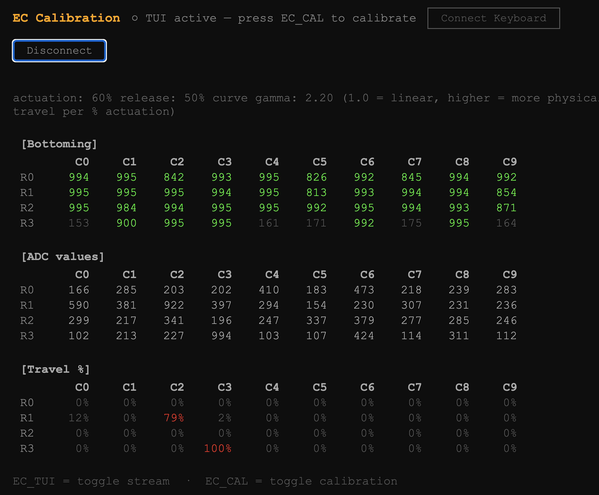

# Le Capybara Firmware

Electrocapacitive sensing (Topre/Niz) PCB in the Le Chiffre layout.

* Keyboard Maintainer: [sporkus](https://github.com/sporkus)
* Hardware Supported: STM32F072
* Hardware design: https://github.com/sporkus/le_capybara_keyboard

```
qmk compile -kb sporkus/le_capybara -km sporkus
qmk flash   -kb sporkus/le_capybara -km sporkus
```

## Bootloader

Enter the DFU bootloader in 3 ways:
* **Bootmagic reset**: Hold the top-left key while plugging in
* **Physical DFU header**: Short the pads while powering up
* **Keycode**: Press `QK_BOOT` if mapped (combo: Q+W+O+P)

## Custom matrix driver (EC)

This keyboard uses electrocapacitive sensing instead of standard switch contacts. `rules.mk` sets:

```makefile
CUSTOM_MATRIX = lite
SRC += matrix.c analog.c ec_switch_matrix.c
```

`CUSTOM_MATRIX = lite` replaces QMK's GPIO matrix scan with custom ADC reads while keeping QMK's debounce logic. The three source files handle: analog discharge sequencing → ADC sampling → threshold comparison → key state.

## EC tuning

Each key has a different capacitive baseline depending on assembly. On first flash, auto-tuning runs a few seconds to measure idle values per key.

These keycodes can be used in your qmk keymap or selected in vial > user keycodes.

| Keycode                   | Action                                              |
|---------------------------|-----------------------------------------------------|
| `EC_AP_I`   | Require deeper press to actuate (less sensitive)    |
| `EC_AP_D`| Require shallower press to actuate (more sensitive) |
| `EC_TUI`                  | Toggle streaming data to calibration tool            |
| `EC_CAL`                  | Toggle bottoming calibration (start / save)         |
| `EC_CLR`                  | Reset stored EC config, re-tune on next boot        |
| `EE_CLR`                  | Full EEPROM reset                                   |


### Calibration Tool
For more accurate calibration, use the calibration tool in `tools/ec_calibration`.
Two versions available:
- [CLI - executable go binary](tools/ec_calibration/ec_calibration )
- [ Web (download and run in chrome) ](tools/ec_calibration/ec_calibration.html)

Usage is the same for both versions:
- Start the tool
- Start data stream using `EC_TUI` keycode
- Start calibration mode using `EC_CAL` keycode
  - Phase 1: Keep hands off keyboard for baseline calibration
  - Phase 2: Tunes bottom out value by pressing each key
- Saves calibration result by sending `EC_CAL` one more time


## More configuration in `config.h`:
The capacitance response isn't linear - a default gamma curve is applied to 
```c
#define ACTUATION_DEPTH 60         // 60% of travel depth
#define RELEASE_DEPTH 50           // 50% of travel depth 
#define CALIBRATION_MIN_TRAVEL 10  // minimum travel as % of expected travel to count a key as bottomed
#define DEFAULT_IDLE 300           // default idle ADC before tuning completes
#define DEFAULT_BOTTOM_ADC 950     // assumed bottom ADC reading before bottoming calibration
#define TRAVEL_CURVE_GAMMA 2.0f    // power curve for actuation: >1 linearises EC's nonlinear capacitance response; 1.0 = linear
```

